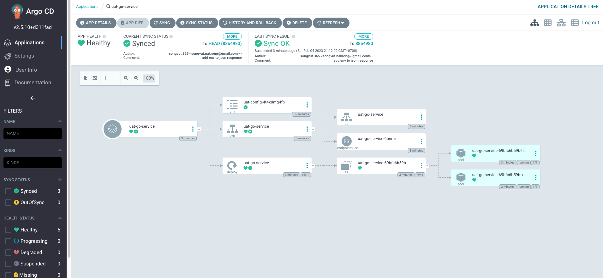

# Go Service

## Argo CD


visit at [http://localhost:8080](http://localhost:8080)

## Go Service

Use cURL for testing
```
$ curl localhost:1323
{
  "message": "Hello, World",
  "env": "uat"
}
```

---

See the original repo to learn more: [gitlab.com/songvut.365/go-service](https://gitlab.com/songvut.365/go-service)